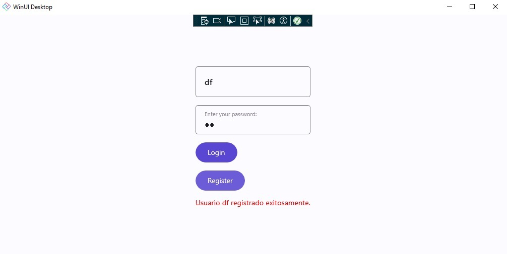

# **Guía del Proyecto: Sistema de Gestión con Eventos y Delegados**

## **Objetivo del Proyecto**  

- Crear una pequeña aplicación de escritorio utilizando Uno Platform en .NET. La aplicación debe incluir al menos una ventana con elementos básicos de UI (botones, etiquetas, etc.).

- Desarrollar una interfaz de usuario simple para la misma aplicación utilizando el patrón MVVM.

- Delegados y Eventos: Implementa un ejemplo donde utilices delegados y eventos en C#. El ejemplo debe demostrar cómo los delegados permiten la comunicación entre diferentes componentes de la aplicación y cómo los eventos son utilizados para manejar interacciones del usuario.


## **Clases y Métodos**

### **Clase: `MainViewModel`**  
El `MainViewModel` actúa como el núcleo del proyecto. Gestiona el estado de la aplicación y se conecta con la vista mediante eventos y comandos.

#### **Propiedades:**  
```csharp
public class MainViewModel : ObservableObject
{
    public string? Username { get; set; }
    public string? Password { get; set; }
    public string? LoginMessage { get; set; }
}

```

- Username y Password: Almacenan las credenciales ingresadas por el usuario.
- LoginMessage: Contiene el mensaje que se mostrará tras una acción de login o registro.

### ** Delegados y eventos **
Los delegados y eventos son una forma de comunicación entre objetos. En este caso, los delegados se utilizan para implementar la interacción del usuario con la vista, mientras que los eventos se utilizan para manejar la lógica de la aplicación. 

```csharp
public delegate void UserActionHandler(string message);
public event UserActionHandler OnLogin;
public event UserActionHandler OnRegister;
```

- Delegado UserActionHandler: Define el esquema para los métodos que manejarán los eventos.
- Eventos OnLogin y OnRegister: Representan las acciones que se desencadenarán al iniciar sesión o registrar un usuario.

### **Metodos principales:**

```csharp
public void Login()
{
    if (string.IsNullOrEmpty(Username) || string.IsNullOrEmpty(Password))
    {
        OnLogin?.Invoke("Por favor, ingresa todos los campos.");
    }
    else
    {
        OnLogin?.Invoke($"Bienvenido, {Username}!");
    }
}
```

- Login: Se utiliza para iniciar sesión en la aplicación. Comprueba si los campos de usuario y contraseña están vacíos, y si no, se invoca el evento OnLogin con el mensaje "Por favor, ingresa todos los campos.".


```csharp
public void Register()
{
    if (string.IsNullOrEmpty(Username) || string.IsNullOrEmpty(Password))
    {
        OnRegister?.Invoke("Por favor, ingresa todos los campos.");
    }
    else
    {
        OnRegister?.Invoke($"Usuario {Username} registrado exitosamente.");
    }
}
```

- Register: Se utiliza para registrar un usuario en la aplicación. Hacemos lo mismo practicamente que en el método Login, solo modificamos el mensaje xD.

### **Handlers de eventos:**

```csharp
private void ShowLoginMessage(string message)
{
    LoginMessage = message;
}

private void ShowRegisterMessage(string message)
{
    LoginMessage = message;
}
```
practicamente los handlers de eventos se utilizan para actualizar el estado de la vista en función de los mensajes que se desencadenan. Haciendo todo dinamico.


## Como se llama o funciona?

Para ejecutar el programa solo basta con ejecutar el archivo principal solo bata iniciar con el comando:

```bash
dotnet run --framework net8.0-windows10.0.26100 
```

obtendras un resultado similar a este:



<div align="center">
<h2>
🛠️ Lo que aprendi
</h2>
</div>

esto me ayudo mucho a entender como funcionan los eventos y delegados en C# y que son muy útiles en la programación. mas que todo para encadenar eventos y poder automatizar tareas en una aplicación